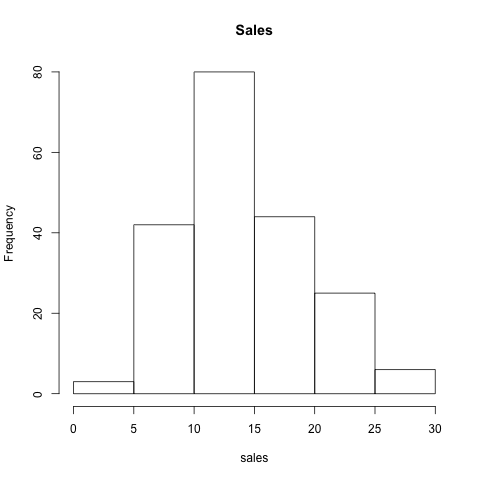
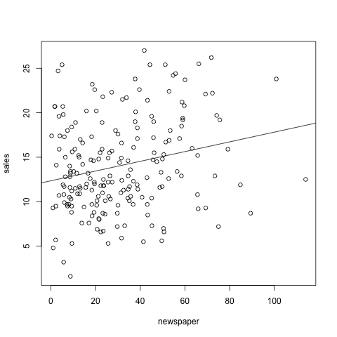
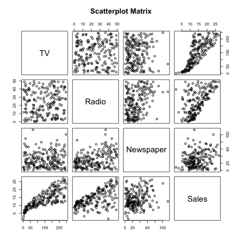
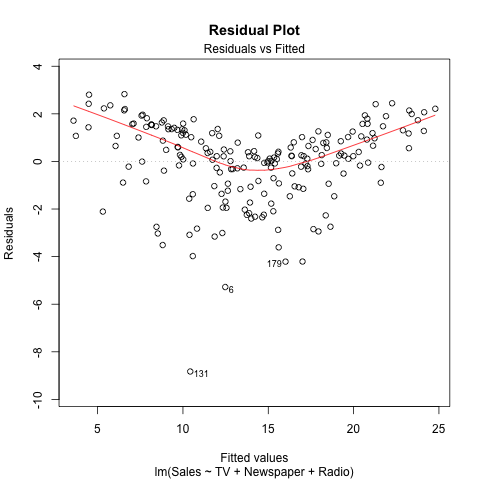
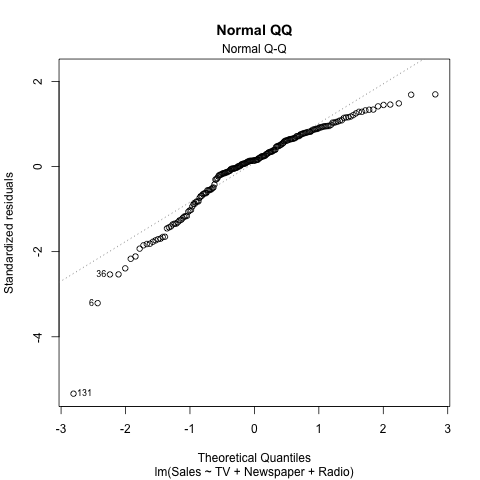

### Abstract

This project largely builds on the content that we worked on in HW02.

We will learn to combine our previous skills and make a simple report from a MakeFile.

**Notes from the Professor**
The purpose of this assignment is to extend the scope of the previous HW.
In addition to keep applying regression analysis in R---using `lm()`---you
will also write some functions as well as their unit tests.

Your mission consists of reproducing the analysis from Section 3.2
(pages 71 to 82), from the book "An Introduction to Statistical Learning"
(by James et al):

[http://www-bcf.usc.edu/~gareth/ISL/](http://www-bcf.usc.edu/~gareth/ISL/)

The data set is in the `Advertising.csv` file available here:

[http://www-bcf.usc.edu/~gareth/ISL/Advertising.csv](http://www-bcf.usc.edu/~gareth/ISL/Advertising.csv)

The main analysis involves carrying out a __multiple linear regression__ with
predictor variables `TV`, `Radio`, `Newspaper`, and the response variable
`Sales`. The ultimate output will be a report replicating the following
results from Chapter 3:

- Table 3.3 (page 72): Coefficient estimates of simple regression models:
`Sales` on `TV`, `Sales` on `Radio`, and `Sales` on `Newspaper`. The book only
shows two tables (those of `Radio` and `Newspaper`) but you should also
include the table for `TV`.
- Table 3.4 (page 74): Coefficient estimates of the least squares model.
- Table 3.5 (page 75): Correlation matrix.
- Table 3.6 (page 76): $RSE$, $R^2$ and $F$-statistic of the least squares model.


### Introduction

We want to be able to replicate this result, possibly if the data changes or anything else changes, we can call upon our MakeFile to change everything for us.

The analysis involves carrying out a multiple linear regression trying to predict sales from TV, Newspaper, Radio.

### Data

Along with the description of the Advertising data set bellow by the professor, we also utilize an RData file with the regression results in it and another text file with the statistical summaries of the data.

Relationships looking at specifically;
1. Sales - TV
2. Sales - Radio
3. Sales - Newspaper


**From the Professor**
The Advertising data set consists of the Sales (in thousands of units) of a particular product in 200 different markets, along with advertising budgets (in thousands of dollars) for the product in each of those markets for three different media: TV, Radio, and Newspaper.

### Methodology

Utilizing the function lm (linear model), we get the coefficients for a regression line. Using the method of least squares, we estimate coefficients for the equation y = mx + b. This time, we do this with multiple variables and even combine them into a single model as shown in the qq-plot and residual.

Eventually we can get:

Sales = a(TV) + b(Sales) + c(Radio) + d

###### Steps takes for the project
   1. gather data
   2. produce the linear model from the data
   3. export all data and create the images
   4. Make the make file connecting everything
   5. Make functions to run statistical tests
   6. Write tests to make sure we wrote the functions right
   7. Write the report and then run the make file to output a PDF file of the report

### Results

```{r echo=TRUE}
load("../data/regression.Rdata")
summarySales = summary(rel_tv_sales)
summaryRadio = summary(rel_radio_sales)
summaryNewspaper = summary(rel_newspaper_sales)
summarySales
summaryRadio
summaryNewspaper
```

Bellow we can find the correlation between all the variables

```{r echo=TRUE}
load("../data/correlation-matrix.Rdata")
cor_matrix
```

The data we are interested in compares the different variables to sales. Sales has the lowest correlation with Newspaper and the most with TV.


> The data has an interesting trend. The spread increases over time. As the TV variables increases, the data points become less concentrated around the sales data. Also interesting is the large P value for the data. This does not seem to be data produced by chance.


### Additional Questions

1. Is at least one of the predictors useful in predicting the response?
    * I think the TV variable is a good at predicting the response. The p-value also shows that this result is highly unlikely to have happened by chance, hinting at a useful predictor.
2. Do all predictors help to explain the response, or are only a subset of predictors useful?
     * They are all statistically significant with a p > .05, but to varying degrees or magnitude. Some of the relationships are undeniably related.
3. How well does the model fit the data?
     * Looking at the scatterplots and the RSS, the model does an okay job at fitting the data, more so TV than the others. With Sales and Newspaper, it is hard to see the linear relationship from the line  
4. How accurate is the prediction
     * For this, lets look at the residual plot bellow and the qq-plot.
     * The qq-plot looks pretty good within two quantiles of the middle.
     * The residual plot isn't great, but the trend is definitely there and I would feel reasonably comfortable with my prediction.

### Conclusions


To summarize, we built upon the last homework by adding more variables, making functions to calculate meaningful statistics, and were able to make better decisions about the relationships between variables. We now have a feasable model to predict sales from TV, Radio, and Newspaper.


--- 

### Plots















