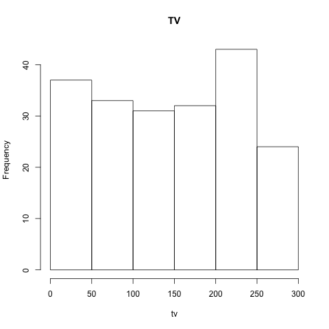
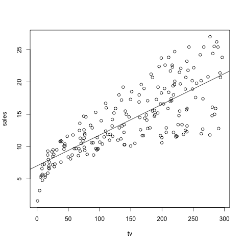

### Abstract

This project largely builds on the content that we worked on in HW02.

We will learn to combine our previous skills and make a simple report from a MakeFile.

**Notes from the Professor**
So far we have been focused on introducing and learning the basic tools
typically used in computational reproducible workflows (e.g. bash, git, github,
Make, markdown, pandoc, and some text editor). However, we haven't done any
statistical data analysis... yet.

The purpose of this assignment is to give you the opportunity to start applying
the computational toolkit (plus R) to reproduce a simple regression analysis.
More specifically, the idea is to reproduce the analysis from Section 3.1
(pages 59 to 71), of _Chapter 3. Linear Regression_,
from the book "An Introduction to Statistical Learning" (by James et al):

[http://www-bcf.usc.edu/~gareth/ISL/](http://www-bcf.usc.edu/~gareth/ISL/)

The data set is in the `Advertising.csv` file available here:

[http://www-bcf.usc.edu/~gareth/ISL/Advertising.csv](http://www-bcf.usc.edu/~gareth/ISL/Advertising.csv)


### Introduction

We want to be able to replicate this result, possibly if the data changes or anthing else changes, we can call upon our MakeFile to change everything for us.

The analysis involves carrying out a simple linear regression of `TV`
advertising on `Sales` of a particular product. The overall idea is to write a
report in which you are able to replicate.

### Data

Along with the description of the Advertising data set bellow by the professor, we also utilize an RData file with the regression results in it and another text file with the statistical summaries of the data.

**From the Professor**
The Advertising data set consists of the Sales (in thousands of units) of a particular product in 200 different markets, along with advertising budgets (in thousands of dollars) for the product in each of those markets for three different media: TV, Radio, and Newspaper.

### Methodology

Utilizing the function lm (linear model), we get the coefficients for a regression line. Using the method of least squares, we estimate coefficients for the equation y = mx + b

Sales = m(TV) + b

###### Steps takes for the project
   1. gather data
   2. produce the linear model from the data
   3. export all data and create the images
   4. Make the make file connecting everything
   5. Write the report and then run the make file to output a PDF file of the report

### Results

```{r echo=TRUE}
load("../data/regression.Rdata")
summary = summary(rel_tv_sales)
summary = summary(rel_radio_sales)
summary = summary(rel_newspaper_sales)

```


The relationships seems to be corrolated. the R-Squared value is above .6 which indicates a relationship, but not a strongly corrolated one.

Bellow are some plots to illustrate the data provided in Advertising.csv







> The data has an interesting trend. The spread increases over time. As the TV variables increases, the data points become less concentrated around the sales data. Also interesting is the large P value for the data. This does not seem to be data produced by chance.


### Additional Questions

1. Is at least one of the predictors useful in predicting the respone?
2. Do all predictors help to explain the response, or are only a subset of predictors useful?
3. How well does the model fit the data?
4. How accurate is the prediction


### Conclusions


To summarize, in this proejct I automated my workflow to gather data and produce the images and the data for a report. Then the RMD file synthesizes that information and uses its dynamic capabilities to include the images and code in the report.
